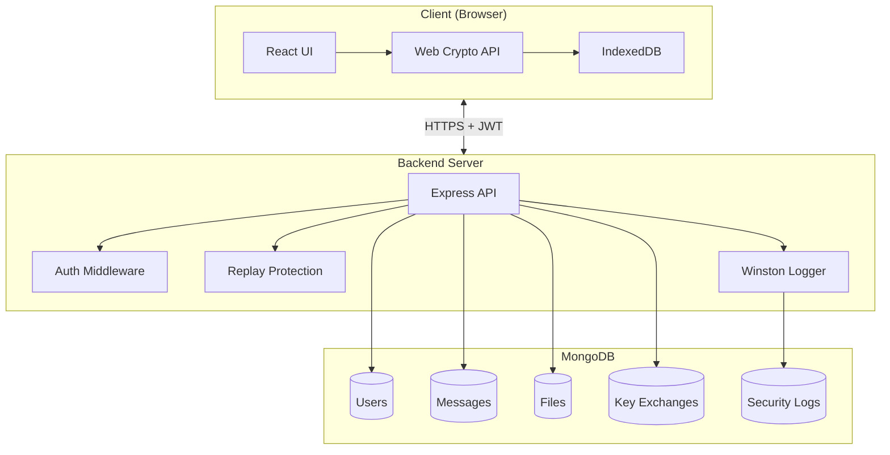
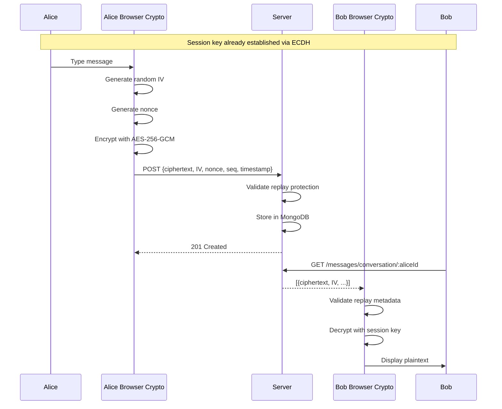
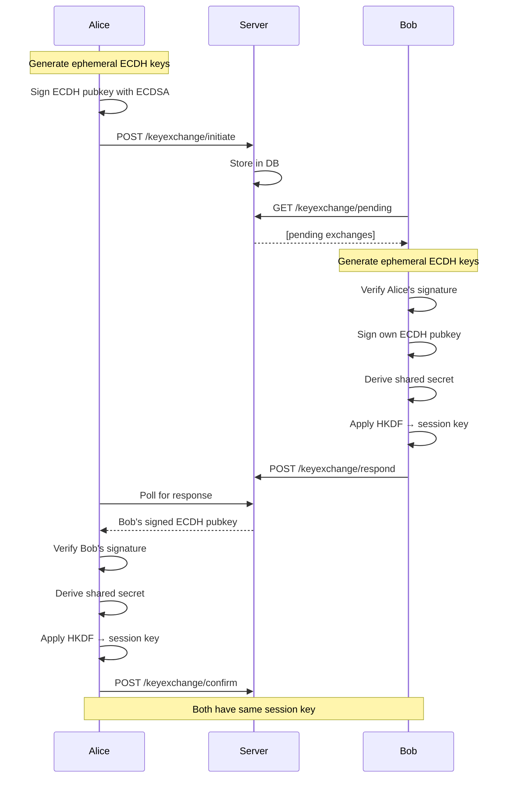

# System Architecture

## High-Level Architecture



## Component Architecture

### Frontend (Client-Side)

#### 1. Cryptography Layer (`src/crypto/`)

**keyManagement.js**
- Generate ECC P-256 key pairs (ECDSA)
- Encrypt/decrypt private keys with PBKDF2
- Store encrypted keys in IndexedDB
- Import/export public keys

**encryption.js**
- AES-256-GCM message encryption
- AES-256-GCM file encryption with chunking
- Random IV generation per message
- Session key management

**keyExchange.js**
- Custom ECDH + ECDSA protocol
- Three-way authenticated handshake
- HKDF session key derivation
- Digital signature creation/verification

**replayProtection.js**
- Nonce generation and validation
- Timestamp checking
- Sequence number tracking
- IndexedDB nonce storage

#### 2. UI Components (`src/components/`)

**Register.jsx**
- User registration form
- Automatic key pair generation
- Private key encryption and storage

**Login.jsx**
- User authentication
- Private key decryption
- JWT token management

**ChatApp.jsx**
- Contact list
- Message encryption/decryption
- Key exchange UI
- Security logs dashboard

#### 3. Services (`src/services/`)

**api.js**
- Axios HTTP client
- JWT token injection
- API endpoint wrappers

### Backend (Server-Side)

#### 1. Routes (`src/routes/`)

**auth.js**
- POST /api/auth/register - User registration
- POST /api/auth/login - Authentication
- GET /api/auth/users - User list
- GET /api/auth/user/:username - Get user by username

**messages.js**
- POST /api/messages - Store encrypted message
- GET /api/messages/conversation/:userId - Get conversation
- DELETE /api/messages/:id - Delete message

**keyExchange.js**
- POST /api/keyexchange/initiate - Start key exchange
- POST /api/keyexchange/respond - Respond to key exchange
- POST /api/keyexchange/confirm - Confirm key exchange
- GET /api/keyexchange/pending - Get pending requests

**files.js**
- POST /api/files/upload - Upload encrypted file
- GET /api/files/:fileId - Download file
- GET /api/files/list/:userId - List files
- DELETE /api/files/:fileId - Delete file

**logs.js**
- GET /api/logs - Get security logs
- GET /api/logs/stats - Get statistics

#### 2. Middleware (`src/middleware/`)

**auth.js**
- JWT verification
- Token decoding
- User attachment to request

**logging.js**
- Winston logger configuration
- Request logging
- Security event logging

**replayProtection.js**
- Nonce uniqueness validation
- Timestamp validation
- Sequence number checking
- Automatic message cleanup

#### 3. Models (`src/models/`)

**User.js**
```javascript
{
  username: String,
  password: String (hashed),
  publicKey: String (ECC P-256),
  createdAt: Date,
  lastLogin: Date
}
```

**Message.js**
```javascript
{
  senderId: ObjectId,
  receiverId: ObjectId,
  ciphertext: String,
  iv: String,
  nonce: String (unique),
  sequenceNumber: Number,
  timestamp: Number,
  createdAt: Date
}
```

**File.js**
```javascript
{
  senderId: ObjectId,
  receiverId: ObjectId,
  filename: String,
  chunks: [{
    data: String,
    iv: String,
    index: Number
  }],
  totalChunks: Number,
  totalSize: Number,
  nonce: String,
  timestamp: Number
}
```

**KeyExchange.js**
```javascript
{
  initiatorId: ObjectId,
  responderId: ObjectId,
  status: String,
  initiatorECDHPublicKey: String,
  initiatorSignature: String,
  initiatorNonce: String,
  responderECDHPublicKey: String,
  responderSignature: String,
  responderNonce: String,
  expiresAt: Date
}
```

**SecurityLog.js**
```javascript
{
  eventType: String,
  userId: ObjectId,
  ipAddress: String,
  userAgent: String,
  severity: String,
  details: Object,
  timestamp: Date
}
```

## Data Flow

### Message Sending Flow



### Key Exchange Flow



## Security Boundaries

### Trust Boundaries

1. **Client ↔ Browser**: Trust relationship (user's device)
2. **Browser ↔ IndexedDB**: Trust relationship (encrypted storage)
3. **Client ↔ Server**: **UNTRUSTED** - All data encrypted before transmission
4. **Server ↔ Database**: Trust relationship (server infrastructure)

### Critical Security Invariants

✅ **Private keys NEVER leave the client**  
✅ **Server NEVER sees plaintext messages**  
✅ **Encryption happens client-side only**  
✅ **IVs are random and non-repeating**  
✅ **Nonces are unique per message**  
✅ **Signatures verified before key derivation**  

## Deployment Architecture

### Development
```
Frontend: http://localhost:5173 (Vite dev server)
Backend:  http://localhost:4000 (Express)
Database: mongodb://localhost:27017
```

### Production (Example)
```
Frontend: https://app.example.com (CDN/Nginx)
Backend:  https://api.example.com (Node.js + PM2)
Database: MongoDB Atlas (replica set)
```

### Required Environment Variables

**Backend (.env)**
```
PORT=4000
MONGO_URI=mongodb://localhost:27017/secure-chat
JWT_SECRET=<strong-random-secret>
FRONTEND_URL=http://localhost:5173
NODE_ENV=development
```

**Frontend (.env)**
```
VITE_API_URL=http://localhost:4000/api
```

## Performance Considerations

1. **Message Encryption**: ~1-2ms per message (Web Crypto API is fast)
2. **Key Generation**: ~100-200ms (done once on registration)
3. **IndexedDB Access**: ~5-10ms per operation
4. **File Chunking**: 64KB chunks for optimal performance
5. **Database Queries**: Indexed on senderId, receiverId, nonce for fast lookups

## Scalability

Current limitations:
- No WebSocket (polling required for real-time)
- File size limited by browser memory
- Session keys not rotated automatically

Future improvements:
- Implement Socket.io for real-time messaging
- Stream large files using Blob URLs
- Automatic session key rotation every N messages
- Multi-device key sync with encrypted cloud backup
